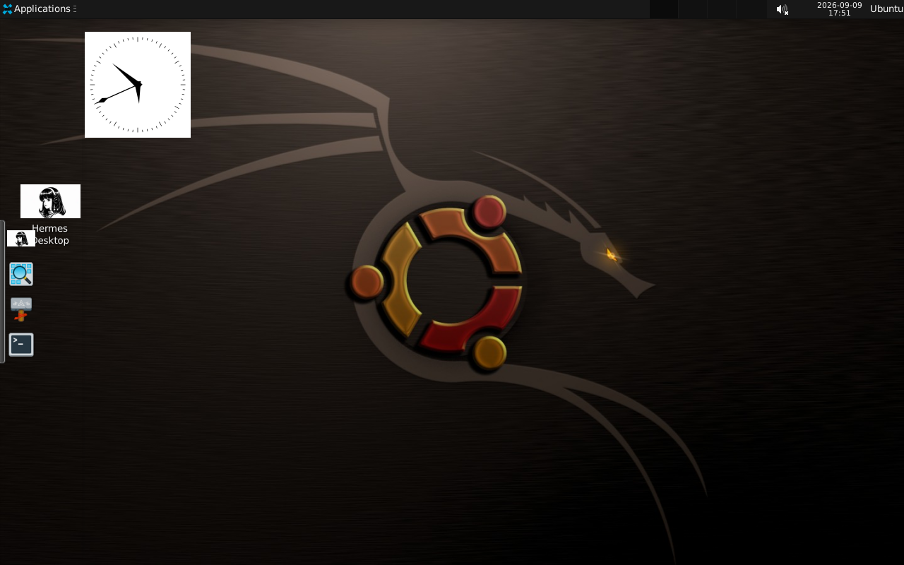

# Ubuntu 24.04 XRDP Development Desktop

An Ubuntu 24.04 LTS Docker container with a graphical XFCE desktop over RDP, developer
tooling, and the upstream Hermes AI agent in the terminal.

## Desktop preview

What a user sees after connecting over RDP, captured in a real `xfreerdp` session logged in as
`ubuntu` (1280x800, first login, nothing hand-edited afterwards):



The layout is the reference look: analog clock widget on the wallpaper, Plank dock with Hermes
Desktop, file manager, terminal and app finder on the left, one top panel (no bottom bar).

## Prerequisites

Docker, installed and running. Check:

```bash
docker --version
docker info >/dev/null && echo "Docker is working"
```

If the second line errors, start Docker Desktop (Windows/macOS) or run
`sudo systemctl start docker` (Linux), then check again.

You also need about 7 GB of free disk space.

## Quick start

Run these one at a time.

**1. Build** (roughly 8 minutes the first time):

```bash
git clone https://github.com/jjkh1673-tech/ubuntu-xrdp.git
cd ubuntu-xrdp
docker build -t ubuntu-xrdp .
```

**2. Start.** Replace `choose-a-strong-password` with your own. Skipping this is the most
common mistake: without it you cannot log in.

```bash
docker run -d \
  --name ubuntu-xrdp \
  -p 3389:3389 \
  -e XRDP_PASSWORD='choose-a-strong-password' \
  -v ubuntu-xrdp-home:/home/ubuntu \
  ubuntu-xrdp
```

**3. Wait ~30 seconds**, then check:

```bash
docker inspect --format '{{.State.Health.Status}}' ubuntu-xrdp
```

Wait until it prints `healthy`. The desktop takes a few seconds to come up.

**4. Connect** with any RDP client:

| Where Docker runs | Address |
| --- | --- |
| Your own computer | `localhost:3389` |
| Another machine | `<that machine's IP>:3389` |

Username `ubuntu`, password from step 2.

Clients: Remmina (Linux), Remote Desktop Connection (Windows), Microsoft Remote Desktop
(macOS).

The container uses a self-signed certificate, so the client warns on first connect. That
is expected — accept it.

## Using the AI agent

Open a terminal in the desktop, or run `docker exec -it ubuntu-xrdp bash`, then:

```bash
ai
```

`ai`, `hermes`, `hermes-ai` and `hermes-agent` all launch the same real Hermes agent.

On first run no provider is configured. Set one up:

```bash
hermes setup
```

Credentials go to `~/.hermes/.env` with `600` permissions. They are never written into the
image, and `hermes status` displays them masked.

## What is included

- Ubuntu 24.04 LTS with an XFCE desktop over XRDP on TCP 3389
- Python 3 with pip, venv and development headers
- C/C++ via build-essential and cmake, with gdb for debugging
- Node.js and npm
- Git, OpenSSH client, ripgrep, jq, shellcheck, htop
- Network and security tools: net-tools, iproute2, dnsutils, tcpdump, nmap
- ffmpeg
- Upstream [Nous Research Hermes Agent](https://github.com/NousResearch/hermes-agent)

**AI Canvas is intentionally removed.** It is obsolete and is not part of this project.

Data-science and ML libraries are deliberately left to `pip` inside a virtualenv, so the
image stays maintainable:

```bash
python3 -m venv ~/venv && source ~/venv/bin/activate
pip install numpy pandas scikit-learn
```

## Persistence

The `-v ubuntu-xrdp-home:/home/ubuntu` volume in step 2 keeps your shell configuration and
Hermes credentials when the container is recreated. Without it they survive
`docker restart` but are lost if you remove the container.

## Useful commands

```bash
docker exec -it ubuntu-xrdp bash          # shell inside the container
docker exec ubuntu-xrdp pgrep -a xrdp     # is XRDP running?
docker logs ubuntu-xrdp                   # startup log
docker restart ubuntu-xrdp                # restart
docker stop ubuntu-xrdp                   # stop
docker rm -f ubuntu-xrdp                  # remove (volume is kept)
```

## Troubleshooting

**Cannot log in over RDP.** `XRDP_PASSWORD` is applied only when the container starts. If
it was missing, the log shows:

```text
WARNING: XRDP_PASSWORD is not set; the ubuntu account cannot be used for password login.
```

Recreate the container with `-e XRDP_PASSWORD=...`. Changing it on a running container
does nothing.

**Status is `starting`, not `healthy`.** Normal for the first ~30 seconds. If it stays
`unhealthy`:

```bash
docker logs ubuntu-xrdp
docker exec ubuntu-xrdp pgrep -a xrdp
docker exec ubuntu-xrdp pgrep -a xrdp-sesman
```

Both `xrdp` and `xrdp-sesman` must be running for the healthcheck to pass.

**Connection refused on 3389.** Confirm the port is published with `docker ps`, then:

```bash
docker exec ubuntu-xrdp ss -ltn
```

**Black or frozen desktop on first login.** Close the client and reconnect; the first
session initialises the XFCE profile and can take a few seconds.

**Hermes says no provider is configured.** Expected on a fresh container. Run
`hermes setup`.

## Known limitations

- The TLS certificate is self-signed, so RDP clients warn on first connect.
- The image is around 7 GB; it bundles a desktop environment and a full build toolchain.
- No GPU acceleration. CUDA workloads need extra configuration.
- The `gh` CLI is not bundled, because it requires a third-party apt repository. Install
  it on demand if you need it.
- Hermes configuration lives in `/home/ubuntu`; see Persistence.

## Security notes

- Do not commit API keys, OAuth tokens, passwords or `.env` files.
- Do not use Docker `ARG`/`ENV` to bake provider secrets into image layers.
- Set `XRDP_PASSWORD` at runtime and use a strong value.
- Configure Hermes providers through `hermes setup`, not through build arguments.

## Scope

A maintainable Ubuntu development workstation: XRDP desktop, developer tooling, and a real
Hermes integration. It does not bundle Kali/BlackArch or bulk security tooling.

## Verification status

Verified on a GitHub Codespace (`standardLinux32gb`: 4 vCPU, 16 GB RAM, root through
passwordless sudo) with Docker 29.7.2, building `main` at 37df461 into an empty image store
after `docker system prune -af`, so nothing was inherited from an earlier build.

| Check | Result |
| --- | --- |
| `docker build` from scratch | PASS - exit 0, image 7.09 GB |
| GitHub Actions CI build | PASS - run #18 on the same commit |
| Container starts and stays up | PASS - `healthy`, restart count 0 |
| Healthcheck (`xrdp` + `xrdp-sesman`) | PASS - both processes running, TCP 3389 listening |
| Real RDP login as `ubuntu` | PASS - username and password typed into the XRDP login window through an `xfreerdp` client session; server log: `login successful for user ubuntu on display 10` |
| XFCE session after login | PASS - session, window manager, panel and Plank all start; no black screen, no disconnect |
| Desktop layout | PASS - single top panel, left Plank dock with Hermes Desktop / files / terminal / app finder, frameless analog clock widget, no home/filesystem/trash icons |
| Root access for the RDP user | PASS - `whoami`, `sudo -i`, `id`, `nproc`, `free -g` and `apt-get -s upgrade` typed into a terminal inside the RDP session (`uid=0(root)`, 4 CPUs, 15 GB); `sudo -l` shows `(ALL) NOPASSWD: ALL`, `/etc/sudoers.d/ubuntu` is `0440` |
| Image is already patched | PASS - `apt-get update && apt-get -s upgrade` inside the container reports `0 upgraded`; base is Ubuntu 24.04.5 LTS |
| Hermes CLI | PASS - `hermes --version` -> `Hermes Agent v0.21.1 (2026.9.7)`; `ai` opens the real agent prompt (19 tools, skill list, `/help`) |
| Hermes Desktop app | PASS - `/usr/local/bin/hermes-desktop-launch` opens the app window inside the RDP session (`Web UI v0.6.7`) |
| First-run state | PASS - `hermes status` and `hermes doctor` run; no provider configured; `~/.hermes/.env` is `600` and owned by `ubuntu`, never baked into an image layer |
| Persistence (the `-v ...:/home/ubuntu` volume) | PASS - a file written in the session survived `docker rm` plus a fresh `docker run` on the same volume |
| `docker restart` | PASS - back to `healthy`, 3389 listening, RDP reconnects to the session |
| Secret scan (repo, image history, image env) | PASS - no `ghp_`, token or password values found |

Not verified: a live request to a model provider - that needs your own API key (`hermes setup`).
`hermes doctor` also reports npm advisories inside the upstream Hermes workspaces; those belong
to the upstream install, not to this image.

## Hermes Desktop (GUI)

Bundles the Electron **Hermes Desktop** app (fork: `jjkh1673-tech/hermes-desktop`, upstream
`sir1st/hermes-desktop`): launcher on the desktop, icon in the Plank dock, and the black-and-white
Hermes artwork as its application icon. The CLI agent stays available as `hermes` / `ai`.
Both editions share the same dock, clock widget and icon styling; the wallpaper is the only thing
that differs - this XFCE edition keeps the classic dark Ubuntu wallpaper, and the MATE edition
(ubuntu-mate-xrdp) uses the blue anime wallpaper.
