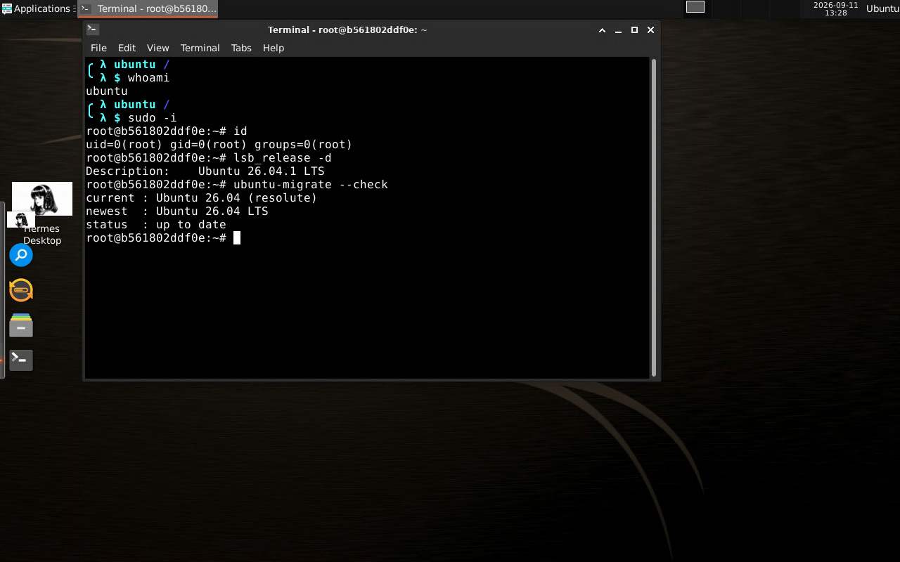

# Ubuntu XRDP desktop (XFCE) with the Hermes Agent

A Docker image of a complete Ubuntu 26.04 LTS desktop that you open with any RDP client. It is
not a demo: after the container starts you get a normal XFCE desktop, a terminal, root through
`sudo`, everyday applications, and the upstream [Hermes Agent](https://hermes-agent.nousresearch.com)
already installed. The system is patched during the build, so you never have to run an update
before working, and a `System Upgrade` tool tells you when a newer Ubuntu LTS exists and moves you
to it without touching your files.

Who it is for: someone who wants a Linux desktop and a coding environment on any machine (Windows,
macOS, Chromebook, an old laptop) without installing Linux on it, and who wants an AI agent that can
actually run commands in that desktop.

## Desktop preview

Both pictures below came out of one `xfreerdp` session that logged in as `ubuntu` with the typed
password, at 1280x800, on the image built by CI from the current commit - nothing was retouched:


Typing into the desktop's own terminal, from the same session:



## What is inside

| Part | Detail |
| --- | --- |
| Base | Ubuntu 26.04 LTS (resolute), every update applied at build time |
| Desktop | XFCE 4.20 over xrdp 0.10, single top panel, left dock (Plank) |
| User | `ubuntu` (uid 1000), passwordless `sudo`, RDP login |
| Terminals & editors | xfce4-terminal (dark palette, 10k scrollback), mousepad, `vim`, `nano` |
| Everyday apps | Thunar (files), mousepad (text editor), ristretto (images), engrampa (archives), mate-calc, xfce4-screenshooter, xfce4-taskmanager, htop |
| Development | git, curl, wget, jq, python3 (+venv/pip/tk), nodejs, npm, build-essential, cmake, gdb, ripgrep, shellcheck, openssh-client, nmap, tcpdump, dnsutils |
| AI | Hermes Agent installed by its own installer, plus `ai`, `hermes`, `hermes-agent`, `hermes-ai` commands and the `hermes desktop` GUI |
| Upgrades | `ubuntu-migrate` command, a `System Upgrade` entry in the menu and dock, and a login notice when a newer Ubuntu LTS exists |
| Ports | 3389/tcp (RDP) |

Nothing is faked or stubbed: no wrapper scripts pretending to be the agent, no half-configured
services. `docker exec` in and everything behaves like the upstream tool.

## Requirements

- Docker installed and running (`docker --version` and `docker info >/dev/null && echo ok`).
- About 15 GB free disk (the finished image is roughly 12 GB) and 4 GB of RAM for the desktop.
- An RDP client: `Remmina` or `mstsc` (Windows), `Microsoft Remote Desktop` (macOS), `xfreerdp` (Linux).

## Run it

```bash
git clone https://github.com/jjkh1673-tech/ubuntu-xrdp.git
cd ubuntu-xrdp
docker build -t ubuntu-xrdp .
docker run -d --name ubuntu-xrdp -p 3389:3389 \
  -v ubuntu-xrdp-home:/home/ubuntu \
  ubuntu-xrdp
docker logs -f ubuntu-xrdp      # stop with Ctrl-C once it says the desktop is ready
```

Then point an RDP client at `localhost` (port 3389) and log in:

```
user: ubuntu
password: 1122
```

The `-v ubuntu-xrdp-home:/home/ubuntu` part is what keeps your files, shell history and Hermes
memory when you delete and recreate the container. Add it always.

To pull a prebuilt image instead of building it (CI publishes this tag on every push to main):

```bash
docker pull ghcr.io/jjkh1673-tech/ubuntu-xrdp:latest
docker run -d --name ubuntu-xrdp -p 3389:3389 -v ubuntu-xrdp-home:/home/ubuntu ghcr.io/jjkh1673-tech/ubuntu-xrdp:latest
```

### First login: change the password

The image ships with the documented default password `1122` so that a personal machine or your own
codespace just works. On anything reachable from outside, change it before you connect anything else:

```bash
docker exec -it ubuntu-xrdp su - ubuntu -c 'passwd'        # inside the container
# or set your own at start-up:
docker run -d --name ubuntu-xrdp -p 3389:3389 -e XRDP_PASSWORD='Y0uRs3cret!' ubuntu-xrdp
# or from inside the desktop: open a terminal and run  passwd
```

The first login also shows a welcome bubble with the same reminder.

### Connecting from another machine

Replace `localhost` with the host's address. Same credentials. If you expose 3389 to the internet,
change the password first and consider a VPN or an SSH tunnel:

```bash
ssh -N -L 3389:localhost:3389 you@that-host      # then connect to localhost:3389
```

### Using a GitHub Codespace instead of your own machine

1. In this repository open **Codepaces → New codespace** (the default 4 vCPU / 16 GB machine is
   what this image was built and verified on).
2. In the codespace terminal run the two `docker` commands from *Run it* above.
3. Open the **Ports** tab, find `3389`, and set *Port visibility* to **Public** if you want to reach
   it from another machine without a tunnel. Codespace ports are forwarded over HTTPS, so an RDP
   client must go through a tunnel instead:
   ```bash
   gh codespace ssh -c <codespace-name> -- -L 3389:localhost:3389
   ```
   then connect an RDP client to `localhost:3389`.
4. Your codespace is private to you even though this repository is public; nothing is shared with
   anyone else unless you hand out the address and the password.

## Root

The `ubuntu` user has full root with no password:

```bash
sudo -i        # uid=0(root)
```

Use it for packages, services and system files. It is deliberate, because the whole desktop is
already isolated in a container.

## Hermes in the terminal

The agent is installed the way its documentation says, for the `ubuntu` user, from
`https://hermes-agent.nousresearch.com/install.sh`. Its home is `~/.hermes` - inside the volume, so
it survives rebuilds.

```bash
ai                # or: hermes
hermes setup      # first run: pick a provider, paste the API key
hermes status
hermes doctor
```

No API key is baked into the image, and no wrapper replaces the real CLI - `ai` and `hermes` are the
same binary, so every upstream command and capability is available.

## Hermes Desktop

`hermes desktop` is the upstream app for this agent, so that is what is used here - it is compiled
into the image at build time and launched by:

- the **Hermes Desktop** icon on the desktop,
- the **Hermes** icon in the left dock,
- the `Hermes Desktop` entry in the Applications menu,
- `/usr/local/bin/hermes-desktop-launch` from a terminal.

It shares the same `~/.hermes` state as the terminal, so a chat you started in the terminal is where
you left it in the app. If you build a custom image without network access, the pre-build is
skipped with a warning and the first launch compiles it (a few minutes, once).

## Staying up to date

The image is fully patched at build time, so right after a fresh start there is nothing to install:

```bash
sudo apt-get update -qq && apt-get -s upgrade | tail -1     # 0 upgraded
```

For the desktop itself there is `ubuntu-migrate` (the **System Upgrade** icon in the dock and menu):

```bash
ubuntu-migrate --check              # current Ubuntu, newest LTS, exit code says if a move is due
ubuntu-migrate --plan               # the exact docker commands that swap the image, keeping the volume
ubuntu-migrate --apply              # refresh packages inside the running container (root)
ubuntu-migrate --migrate-lts        # Ubuntu's own do-release-upgrade, if you prefer in-place
ubuntu-migrate notifications off    # stop the login notice; 'on' turns it back
```

Once per release you get a notification when a newer LTS exists. It never installs anything on its
own. Because your `/home/ubuntu` is a volume, `--plan` is the safe path: pull the new image, recreate
the container, and every file, setting and Hermes state comes with you unchanged.

## Repository layout

```
Dockerfile                  the image: Ubuntu 26.04 + XFCE + xrdp + tooling + Hermes
start.sh                    container entrypoint: dbus, audio, xrdp, then tails the RDP log
assets/apply-theme.sh       per-login session look (theme, icons, wallpaper, dock position)
assets/*.desktop            autostart entries: theme, plank, welcome notice, upgrade notice
assets/*.dockitem           what the left dock pins
assets/xfce4-terminal.xml   terminal colours, font and scrollback defaults
assets/ubuntu-migrate       the System Upgrade tool
assets/hermes-desktop-launch  launches `hermes desktop`
assets/wallpaper.png        the desktop background
.github/workflows/ci.yml    builds the image on every push
```

## Customising

- Wallpaper: replace `assets/wallpaper.png` and rebuild; the session script points at it.
- Dock: edit the `assets/*.dockitem` files - one line each, pointing at a `.desktop` file.
- More packages: add them to the `apt-get install` list in the Dockerfile.
- No clock widget: the desktop is deliberately plain; the panel keeps the stock XFCE clock.

## Troubleshooting

| Symptom | Fix |
| --- | --- |
| RDP client says the certificate is untrusted | Expected: xrdp generates a self-signed certificate. Accept it or pass `/cert:ignore` to `xfreerdp`. |
| Login window appears and immediately disconnects | Wrong password, or the volume's `/home/ubuntu` is not writable: `docker logs ubuntu-xrdp`. |
| Black screen after login | Delete the session: `docker exec ubuntu-xrdp rm -f /home/ubuntu/.xsession-errors` then reconnect; if it repeats, `docker restart ubuntu-xrdp`. |
| `xrdp: already running` after a restart | The entrypoint removes the stale pid files; if you replaced `start.sh`, keep `rm -f /var/run/xrdp/*.pid`. |
| No sound | Audio redirection is best-effort; check `/var/log/pulseaudio.log` inside the container. |
| Want a fresh desktop | `docker rm -f ubuntu-xrdp && docker volume rm ubuntu-xrdp-home` then run again. |

## Verified

Every push to `main` runs these checks in CI: the job builds and publishes the image, starts the
container, connects with a real `xfreerdp` client, types the credentials into the login window and
reads the numbers back from the live session. The values in the table come from run 1 on commit
`10efac6`, on GitHub's `ubuntu-latest` runner (4 vCPU, 16 GB, root).

| What was checked | How it was checked | Result |
| --- | --- | --- |
| Image builds from a clean checkout | `docker build` on the pushed commit in CI | success - the image is 5 777 274 874 bytes (5.4 GiB) |
| Container comes up and stays up | `docker inspect` health and restart count | `healthy`, restarts 0 |
| RDP login typed by hand | `xfreerdp` against `localhost:3389`; `ubuntu` and `1122` typed into xrdp's own form | `Access permitted for user: ubuntu`, `X server :10 is working`, `Session in progress on display :10` |
| The client really receives the desktop | distinct colours in the screenshot the client was shown (xrdp's grey login dialog is under 30) | 30 006 colours right after the login, 9 641 in the terminal shot |
| No clock widget on the desktop | `pgrep -c xclock` | 0 |
| Dock and desktop contents | `ls ~/.config/plank/dock1/launchers` and `ls ~/Desktop` | hermes, thunar, xfce4-terminal, xfce4-appfinder, ubuntu-migrate; `hermes-ai.desktop` on the desktop |
| Wallpaper is the file in this repository | md5 inside the image vs the repository file | `643258f064b073eabe6daf077955cb63` in both |
| Root for the RDP user | `sudo -n id -un` inside the session | `root`, uid 0 |
| Nothing waiting to be updated after the setup | `apt-get -s upgrade` inside the session | `0 upgraded, 0 newly installed, 0 to remove and 0 not upgraded` |
| Hermes agent | `hermes --version` inside the session | Hermes Agent v0.21.1 (2026.9.7) - upstream 87065175 |
| Hermes commands installed for the desktop | `ls /usr/local/bin` | `ai`, `hermes`, `hermes-agent`, `hermes-ai`, `hermes-desktop-launch`, `ubuntu-migrate`, `apply-theme.sh`, `first-run-notice` |
| Desktop app built into the image | `hermes desktop --build-only` runs during the build; the packaged artifact is then launched by the dock and the desktop icon | upstream `hermes desktop` command, no third-party package |
| Desktop app actually starts in the session | the CI job runs `/usr/local/bin/hermes-desktop-launch` inside the RDP session and counts the processes it leaves behind | 9 processes, the main one being `~/.hermes/hermes-agent/apps/desktop/release/linux-unpacked/Hermes`, and 2 959 colours on the client screen while it comes up |
| Published image can be pulled without a login | anonymous manifest request against `ghcr.io` | HTTP 200 for `:latest` and `:26.04` |
| System Upgrade tool | `ubuntu-migrate --check` inside the session | `current : Ubuntu 26.04 (resolute)`, `newest : Ubuntu 26.04 LTS`, `status : up to date` |
| Login notice and its switch | marker file `~/.config/first-run-notice.done`; `ubuntu-migrate notifications off` | notice shown once; the switch writes `~/.config/ubuntu-migrate/config` |
| Terminal look | the shipped default profile read back from the session | background #10131A, 16-colour palette, 10 000-line scrollback, two-line `lambda` prompt |
| Restart and log in again | `docker restart`, then a second typed login | `healthy`, desktop came back on the second login |
| Your files survive a new container | a file written in the session, then `docker rm` + `docker run` with the same volume | `persisted after recreating the container: written 2026-09-11T13:30:02+00:00` |
| Nothing secret in the repository | grep of the pushed tree for `ghp_`, `github_pat_`, `sk-`, API-key shapes | no matches |

Not verified, and not verifiable from here: an actual model request through Hermes (that needs your
own provider key, which is deliberately not in the image), and accelerated video or 3D playback -
an RDP session is software-rendered.

The two screenshots above are the `03-desktop-after-login.png` and `04-typed-terminal.png` captures
from that same run's `rdp-screenshots` artifact - every green run attaches its own captures under
Actions. Re-runs reproduce every number except the image size (a few MiB of variance from build
timestamps) and the wall-clock values quoted verbatim above.

The codespace route is open too; note that the free account's Codespaces budget decides whether one
can be created right now (when it is spent, `gh codespace create` answers
`HTTP 402: out of monthly free usage or have exceeded your budget`). The CI runner is the same size
as the `standardLinux32gb` codespace, and every command in this table works unchanged in a
codespace:

```bash
gh codespace create -R jjkh1673-tech/ubuntu-xrdp -m standardLinux32gb
gh codespace ssh -c <name> -- bash -lc 'cd /workspaces/ubuntu-xrdp && docker build -t ubuntu-xrdp . && docker run -d --name ubuntu-xrdp -p 3389:3389 -v ubuntu-xrdp-home:/home/ubuntu ubuntu-xrdp'
```


## Notes

- The image is MIT-licensed like the desktop it installs; Hermes Agent is upstream (Nous Research)
  and is fetched by its own installer at build time, so the agent you get is the one upstream ships.
- No API key, token or password other than the documented default is stored in the image.
- Firefox and Chrome are snap packages on Ubuntu and snapd cannot run inside this container, so a
  browser is not preinstalled; `xdg-open` and the Hermes browsing tools still work with any browser
  you install from a `.deb`.
